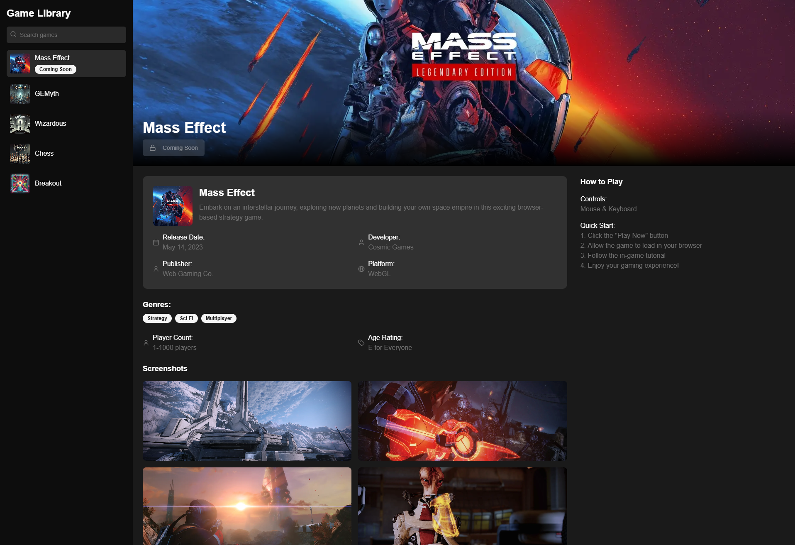
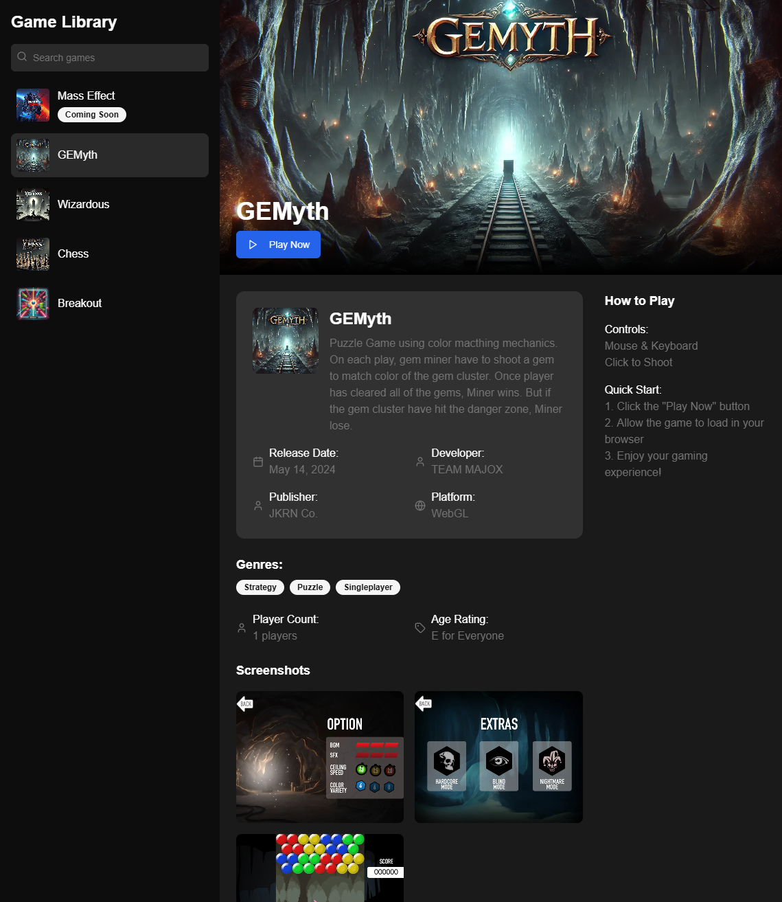
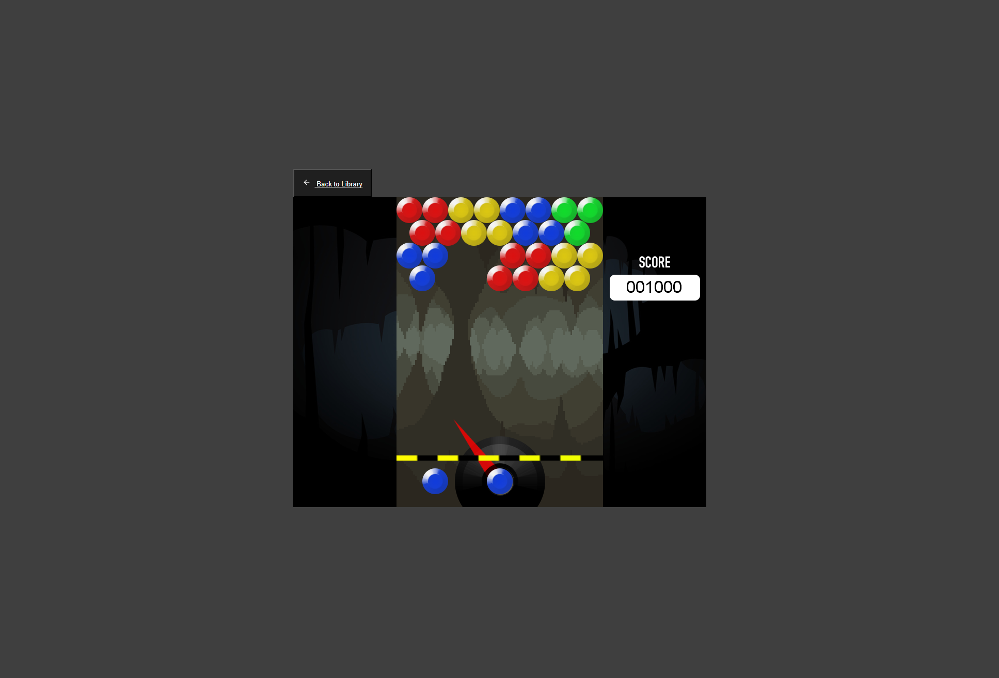
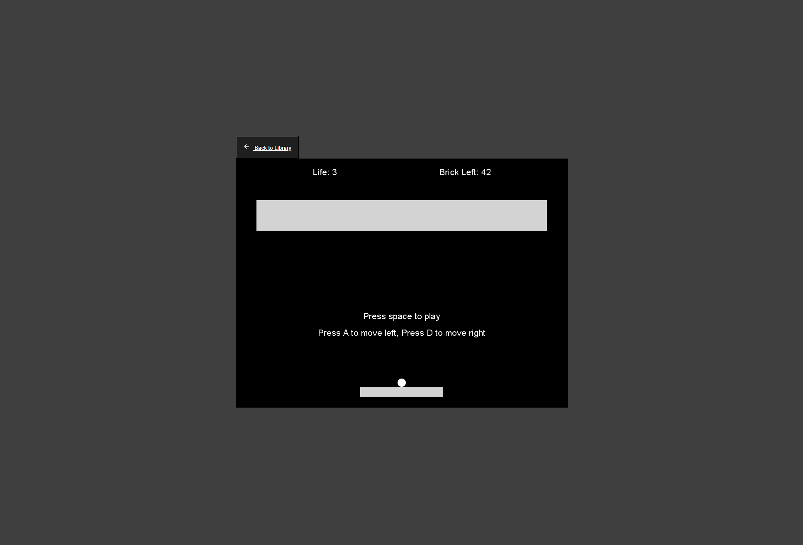
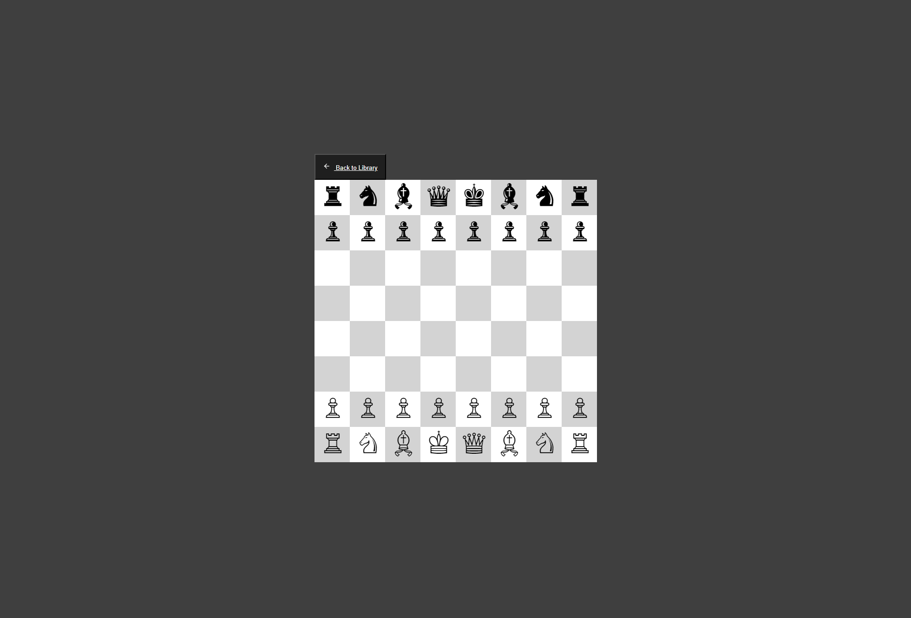
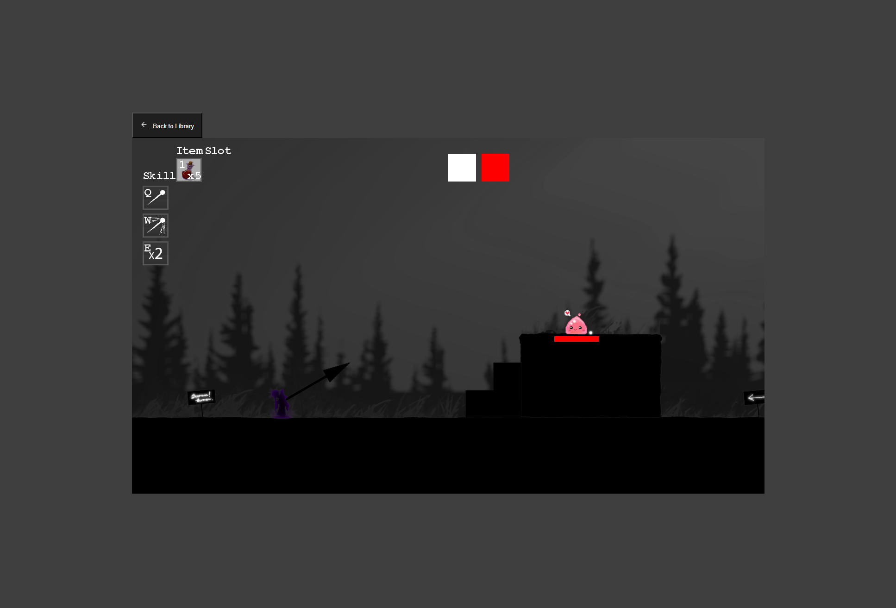

# WebCGP-KMITL

A web-based game launcher that hosts a collection of games, allowing users to play them directly in their web browser.



## Introduction

**WebCGP-KMITL** is a platform that showcases a variety of games on a single web page. Users can browse through the game collection and play any game with a simple click. The web interface is built using Next.js and Tailwind CSS for a responsive and modern user experience. The games are developed in C# using the MonoGame framework, re-engineered with **kniEngine**, and compiled into WebAssembly (WASM) using Blazor, allowing them to run smoothly in web browsers.

## Game Collection

The games featured in this collection originate from another project developed using the **C# MonoGame** framework, which can be found here: [CGP-KMITL](https://github.com/MajorTom3K1M/CGP-KMITL). Originally, these games were desktop applications and could not be played in a web browser. To make them accessible online:

- **Re-engineering**: The games were modified and adapted using **kniEngine**, a custom game engine.
- **WebAssembly Compilation**: The modified games were compiled into WebAssembly (WASM) using **Blazor**, enabling them to run directly in web browsers.
- **Browser Compatibility**: This process allows the games to maintain performance and functionality similar to their desktop versions while being playable without any additional downloads.

By transforming these MonoGame projects into web-compatible applications, we provide users with the convenience of playing rich, interactive games directly from their browsers.

## Features

- **Game Collection Page**: Browse a list of games with descriptions and thumbnails.
- **One-Click Play**: Launch games directly from the web page without any additional downloads.
- **Responsive Design**: Enjoy a seamless experience across various devices and screen sizes.
- **Dockerized Setup**: Simplify development and deployment with Docker and Docker Compose.

## Technologies Used

- **Next.js**: Server-side rendering and static site generation for React applications.
- **Tailwind CSS**: Utility-first CSS framework for rapid UI development.
- **C# and Blazor**: Build interactive web applications using C# and run them in the browser with WebAssembly.
- **MonoGame Framework**: Create cross-platform games with C#.
- **kniEngine**: Custom game engine for compiling games into WebAssembly.
- **Docker & Docker Compose**: Containerization for easy setup and deployment.

## Prerequisites

- **Docker**: Make sure Docker is installed on your system. [Get Docker](https://www.docker.com/get-started)

## Installation

Follow these steps to set up the project on your local machine:

1. **Clone the Repository**

   ```bash
   git clone https://github.com/MajorTom3K1M/WebCGP-KMITL.git
   cd WebCGP-KMITL
   ```

2. **Run the Application with Docker Compose**

   ```bash
   docker-compose up --build
   ```

   This command builds and starts the Docker containers defined in the `docker-compose.yml` file.

3. **Access the Web Application**

   Open your web browser and navigate to `http://localhost:5000` to view the game launcher.

## Build Game

   ```
   dotnet publish --configuration Release --output ./publish
   ```

## Usage

- **Browse Games**

  On the homepage, you'll find a collection of games. Each game includes a thumbnail, title, and brief description.

- **Play a Game**

  Click the **Play** button associated with a game to launch it directly in your browser. The game runs using WebAssembly, providing a smooth gaming experience.

## Screenshots

Here are some screenshots of **WebCGP-KMITL** in action:

### Home Page



### In-Game Screenshot





